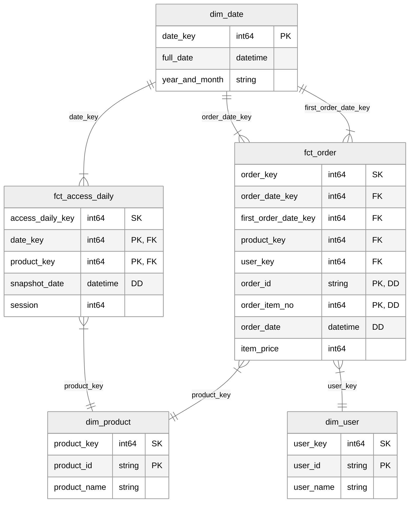
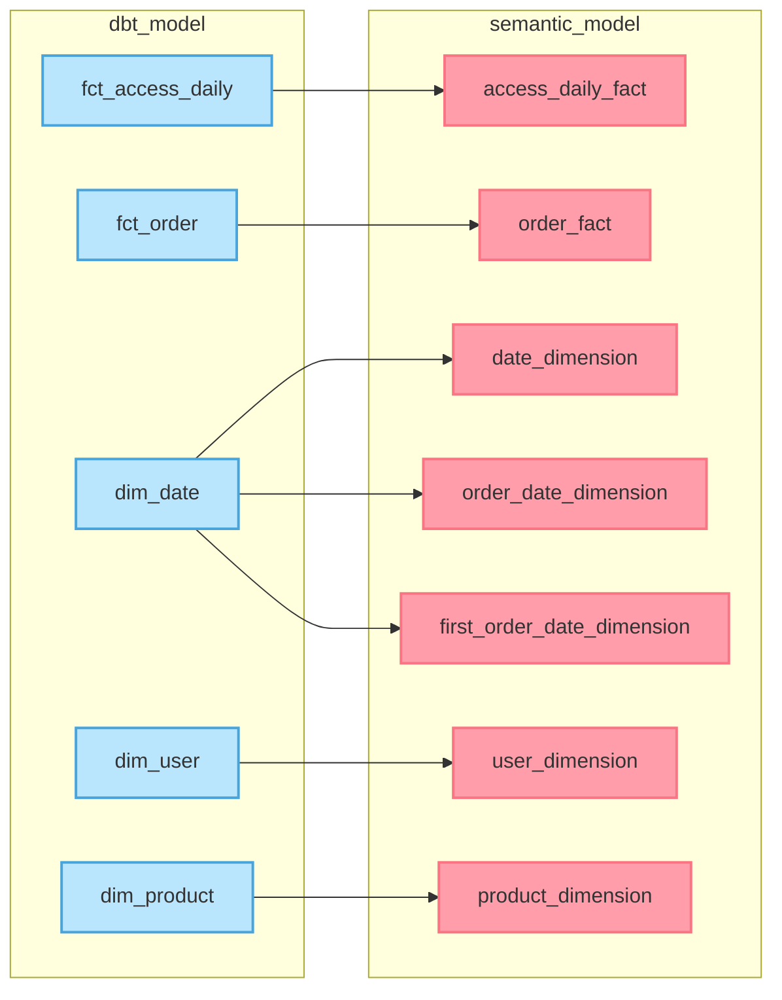
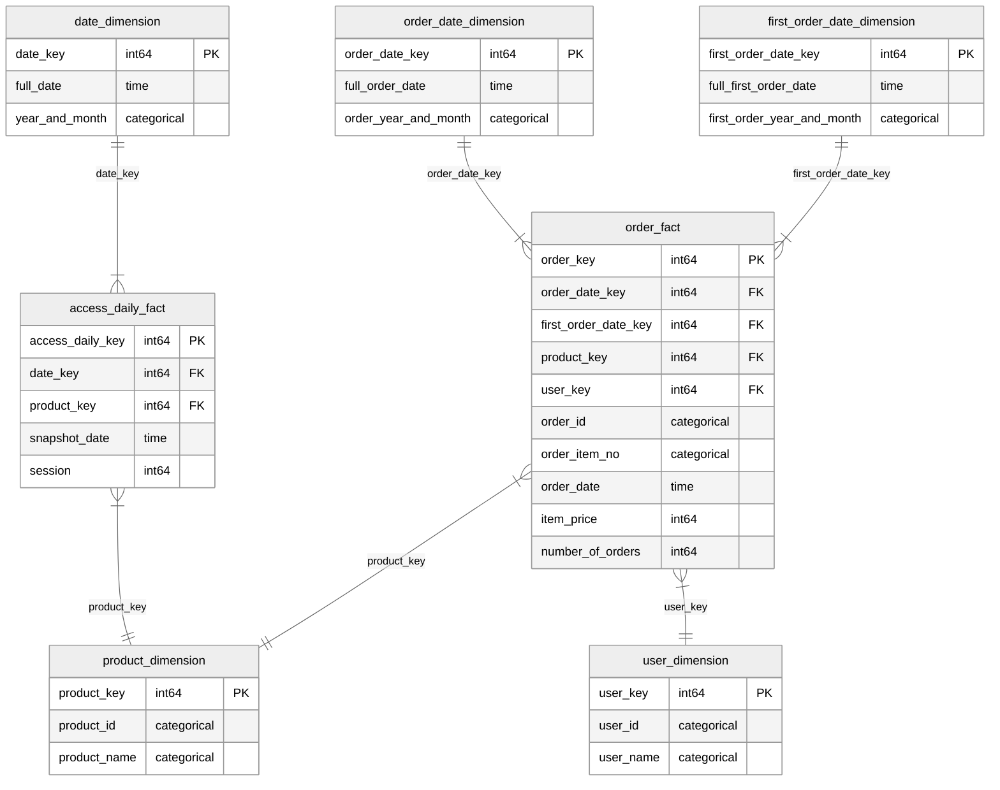
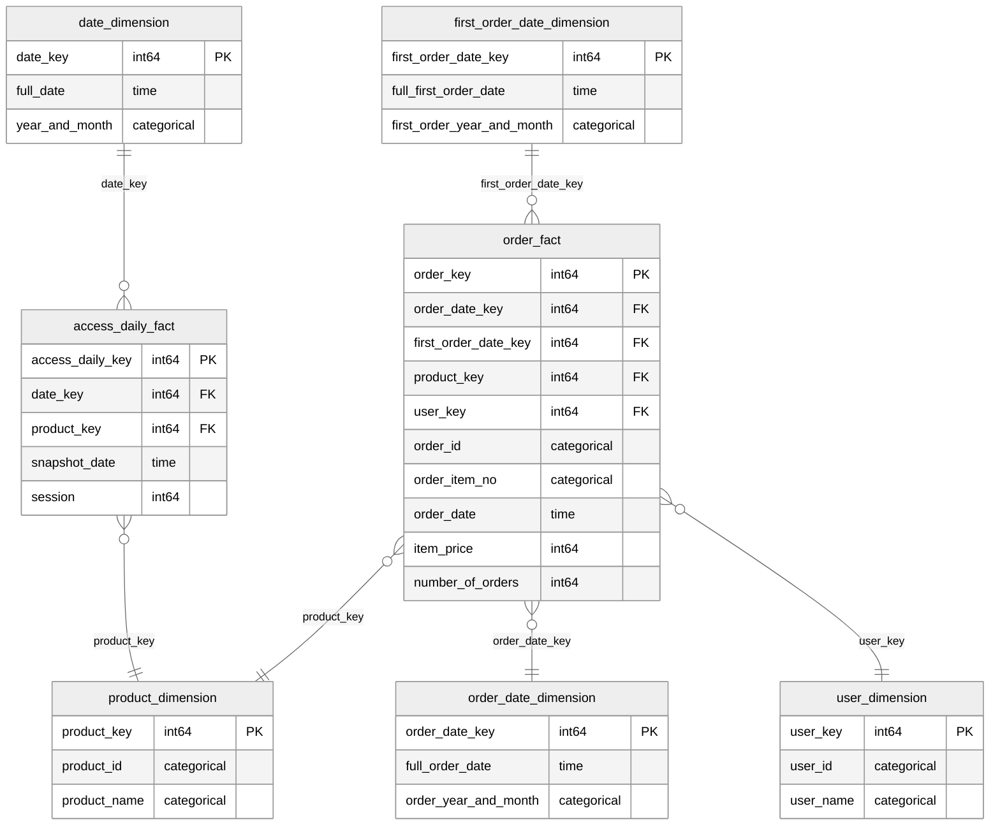

# dbt Semantic Layer の セマンティックモデルの関係性を mermaid.js の ER 図 で可視化する

## 概要

dbt によるデータモデリングのプロジェクトにおいて、物理モデル（dbt Model）から論理モデル（Semantic Model）への変換を行う際、セマンティックモデル間の関係性を可視化するために、mermaid.js を利用して ER 図を描画する。

- データ構造:
  - 物理モデル（dbt モデル）: スタースキーマ
  - 論理モデル（セマンティックモデル）: スタースキーマ
- 手段:
  - メタデータの取得手段: Discovery API（dbt Cloud）
  - プログラミング言語: Python
  - ER 図の可視化: mermaid.js

### 物理モデル（dbt Model）の構造

- データモデル: スタースキーマ（マルチスター）
- ファクトテーブル:
  - `fct_order`: 注文トランザクション・ファクトテーブル
  - `fct_access_daily`: アクセス定期スナップショット・ファクトテーブル
- ディメンションテーブル:
  - `dim_date`: 日付ディメンションテーブル（3 Role play）
  - `dim_product`: 商品ディメンションテーブル
  - `dim_user`: 顧客ディメンションテーブル



### 論理モデルへの変換



### 変換後のモデル構造

論理モデルへの変換により、セマンティックモデル間の関係性を表した ER 図は、以下のようになります。



## 実行方法

### 準備

`.env` ファイルを作成し、以下の内容を記述します。

```plain:.env
DBT_ENVIRONMENT_ID={{ YOUR_ENVIRONMENT_ID }}
DBT_DISCOVERY_API_KEY={{ YOUR_DISCOVERY_API_KEY }}
DBT_DISCOVERY_API_ENDPOINT={{ YOUR_DISCOVERY_API_ENDPOINT }}
```

Discovery API のエンドポイントは、以下のドキュメントを参考に設定してください。

https://docs.getdbt.com/docs/dbt-cloud-apis/discovery-querying#discovery-api-endpoints

### 実行

`main.py` を実行すると、Discovery API から取得したセマンティックモデルのメタデータをもとに、mermaid.js で ER 図を描画するコードが出力されます。

```bash
$ python main.py
```

```console:出力結果
erDiagram

access_daily_fact {
  access_daily_key int64 PK
  date_key int64 FK
  product_key int64 FK
  snapshot_date time
  session int64
}

date_dimension {
  date_key int64 PK
  full_date time
  year_and_month categorical
}

first_order_date_dimension {
  first_order_date_key int64 PK
  full_first_order_date time
  first_order_year_and_month categorical
}

order_date_dimension {
  order_date_key int64 PK
  full_order_date time
  order_year_and_month categorical
}

order_fact {
  order_key int64 PK
  order_date_key int64 FK
  first_order_date_key int64 FK
  product_key int64 FK
  user_key int64 FK
  order_id categorical
  order_item_no categorical
  order_date time
  item_price int64
  number_of_orders int64
}

product_dimension {
  product_key int64 PK
  product_id categorical
  product_name categorical
}

user_dimension {
  user_key int64 PK
  user_id categorical
  user_name categorical
}

date_dimension ||--o{ access_daily_fact : "date_key"
access_daily_fact }o--|| product_dimension : "product_key"
order_fact }o--|| order_date_dimension : "order_date_key"
first_order_date_dimension ||--o{ order_fact : "first_order_date_key"
order_fact }o--|| product_dimension : "product_key"
order_fact }o--|| user_dimension : "user_key"

%%{init: {
  "theme": "neutral",
  "themeCSS": [
    ".er.relationshipLabel { fill: black; }",
    ".er.relationshipLabelBox { fill: white; }",
    ".er.entityBox { fill: light; }",
    "[id*=dimension] .er.entityBox { fill: #ffbf00; }",
    "[id*=fact] .er.entityBox { fill: lightblue; }"
  ]
}}%%
```

この出力結果を描画できる環境で使用すると、セマンティックモデルの関係性を可視化することができます。


