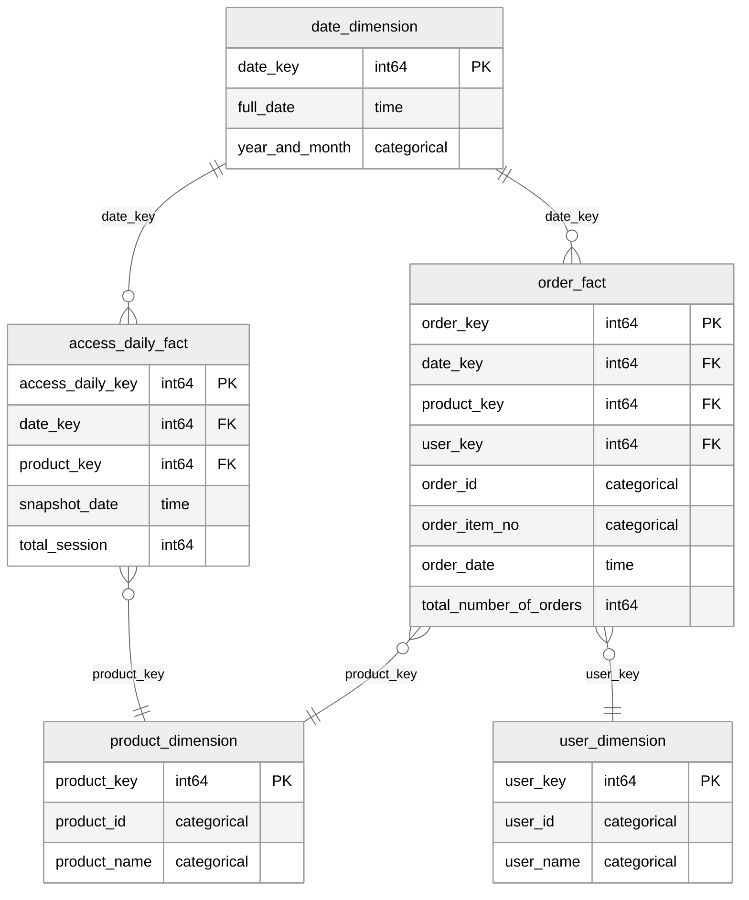

# dbt Semantic Model のリレーションを mermaid で可視化する

## サンプル

### ER 図



### dbt Semantic Model

#### fct_order

```yaml
semantic_models:
  - name: order_fact
    model: ref('fct_order')
    description: "注文トランザクション・ファクトテーブル"
    defaults:
      agg_time_dimension: order_date

    entities:
      - name: order_key
        type: primary
        expr: order_key

      - name: date_key
        type: foreign
        expr: date_key

      - name: product_key
        type: foreign
        expr: product_key

      - name: user_key
        type: foreign
        expr: user_key

    dimensions:
      - name: order_id
        type: categorical
        label: "注文ID"
        description: ""

      - name: order_item_no
        type: categorical
        label: "注文アイテム番号"
        description: ""

      - name: order_date
        type: time
        type_params:
          time_granularity: day
        label: "注文日時"
        description: ""

    measures:
      - name: total_number_of_orders
        agg: count_distinct
        expr: order_id

metrics:
  - name: total_number_of_orders
    label: "注文件数"
    description: ""
    type: simple
    type_params:
      measure: total_number_of_orders
```

#### fct_access_daily

```yaml
semantic_models:
  - name: access_daily_fact
    model: ref('fct_access_daily')
    description: "アクセス定期スナップショット・ファクトテーブル"
    defaults:
      agg_time_dimension: snapshot_date

    entities:
      - name: access_daily_key
        type: primary
        expr: access_daily_key

      - name: date_key
        type: foreign
        expr: date_key

      - name: product_key
        type: foreign
        expr: product_key

    dimensions:
      - name: snapshot_date
        type: time
        type_params:
          time_granularity: day
        label: "日付"
        description: ""

    measures:
      - name: total_session
        agg: sum
        expr: session

metrics:
  - name: total_session
    label: "セッション数"
    description: ""
    type: simple
    type_params:
      measure: total_session

  - name: cvr
    label: "CVR"
    description: ""
    type: derived
    type_params:
      expr: safe_divide(total_number_of_orders, total_session)
      metrics:
        - name: total_number_of_orders
        - name: total_session
```

#### dim_date

```yaml
semantic_models:
  - name: date_dimension
    model: ref('dim_date')
    description: "日付ディメンションテーブル"

    entities:
      - name: date_key
        type: primary
        expr: date_key

    dimensions:
      - name: full_date
        type: time
        type_params:
          time_granularity: day
        label: "日付"
        description: ""

      - name: year_and_month
        type: categorical
        label: "年月"
        description: ""
```

#### dim_product

```yaml
semantic_models:
  - name: product_dimension
    model: ref('dim_product')
    description: "商品ディメンションテーブル"

    entities:
      - name: product_key
        type: primary
        expr: product_key

    dimensions:
      - name: product_id
        type: categorical
        label: "商品ID"
        description: ""

      - name: product_name
        type: categorical
        label: "商品名"
        description: ""
```

#### dim_user

```yaml
semantic_models:
  - name: user_dimension
    model: ref('dim_user')
    description: "ユーザーディメンションテーブル"

    entities:
      - name: user_key
        type: primary
        expr: user_key

    dimensions:
      - name: user_id
        type: categorical
        label: "ユーザーID"
        description: ""

      - name: user_name
        type: categorical
        label: "ユーザー名"
        description: ""
```
